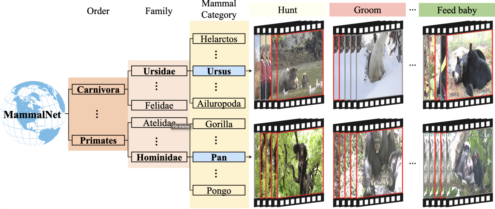

# MammalNet: A Large-scale Video Benchmark for Mammal Recognition and Behavior Understanding (CVPR 2023)

[Jun Chen](https://junchen14.github.io/), [Ming Hu](https://minghu0830.github.io/), [Darren J. Coker](https://reefecology.kaust.edu.sa/people/details/dr.-darren-coker), [blair Costelloe](https://blaircostelloe.com/), [Michael L. Berumen](https://www.kaust.edu.sa/en/study/faculty/michael-berumen), [Sara Beery](https://beerys.github.io/), [Anna Rohrbach](https://anna-rohrbach.net/) and [Mohamed Elhoseiny](https://www.mohamed-elhoseiny.com/). 


<a href='https://mammal-net.github.io/'></a>  <a href='https://arxiv.org/abs/2306.00576'></a> [](https://www.youtube.com/watch?v=sY71Oag2JMw)

[](https://mammal-net.github.io/)

[](https://mammal-net.github.io/)


## Introduction

MammalNet is built around a biological mammal taxonomy spanning 17 orders, 69 families and 173 mammal categories,
and includes 12 common high-level mammal behaviors (e.g. hunt, groom). We establish three benchmarks on MammalNet:
standard animal and behavior recognition, compositional low-shot animal and behavior recognition, and behavior detection.

## Dataset Download

To download the required files, follow these steps:


1. **Trimmed Video Files:**
   ```bash
   wget https://mammalnet.s3.amazonaws.com/trimmed_video.tar.gz
   ```

2. **Annotation Files:**
   ```bash
   wget https://mammalnet.s3.amazonaws.com/annotation.tar
   ```
3. **Full-length Video Files:**
   ```bash
   wget https://mammalnet.s3.amazonaws.com/full_video.tar.gz
   ```


<!-- 

## Installation

Please find installation instructions for PyTorch and PySlowFast in [INSTALL.md](INSTALL.md). You may follow the instructions in [DATASET.md](slowfast/datasets/DATASET.md) to prepare the datasets.
 -->


## Running our baseline codes

### Recognition
Please refer [recognition page](recognition/README.md) to prepare the dataset and run code
### Detection
Please refer [detection page](detection/README.md) to prepare the dataset and run code


```
@InProceedings{Chen_2023_CVPR,
    author    = {Chen, Jun and Hu, Ming and Coker, Darren J. and Berumen, Michael L. and Costelloe, Blair and Beery, Sara and Rohrbach, Anna and Elhoseiny, Mohamed},
    title     = {MammalNet: A Large-Scale Video Benchmark for Mammal Recognition and Behavior Understanding},
    booktitle = {Proceedings of the IEEE/CVF Conference on Computer Vision and Pattern Recognition (CVPR)},
    month     = {June},
    year      = {2023},
    pages     = {13052-13061}
}
```
